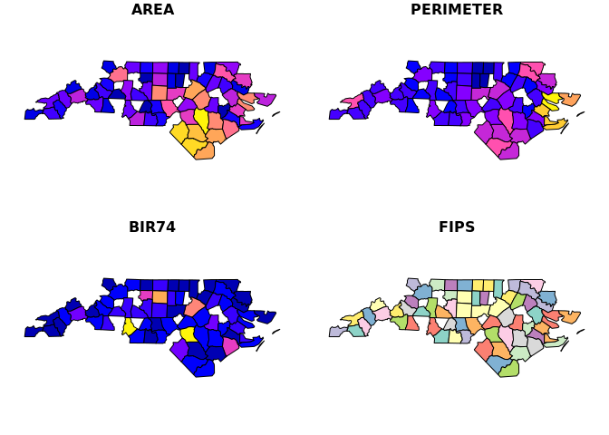

<!-- README.md is generated from README.Rmd. Please edit that file -->

# RGDALDB

The goal of RGDALDB is to provide a DBI wrapper for GDAL’s `ExecuteSQL`
in sf.

## What’s here?

A patchy work through of *building a DBI backend* for GDAL using sf.

The core is `sf::st_read(, query = '')` in an unsupported branch of sf,
it relies on **OGRSQL**, which is not a real database engine.

<https://www.gdal.org/ogr_sql.html>

But, we should be able to make it useable using the DBI abstractions and
support in dbplyr.

These official guides to doing this have been partly implemented in this
package:

<https://cran.r-project.org/web/packages/DBI/vignettes/backend.html>

<https://cran.r-project.org/web/packages/dbplyr/vignettes/new-backend.html>

There is significant overlap in the support in sf to read from PostGIS,
so that needs clarifying.

## Installation

``` r
remotes::install_cran("sf")
devtools::install_github("mdsumner/RGDALDB")
```

## Example

A pretty good example, ideally no data is read until `collect()` is
called.

``` r
library(dplyr)
#> 
#> Attaching package: 'dplyr'
#> The following objects are masked from 'package:stats':
#> 
#>     filter, lag
#> The following objects are masked from 'package:base':
#> 
#>     intersect, setdiff, setequal, union
library(DBI)
library(RGDALDB)

con <- DBI::dbConnect(RGDALDB::GDALDB(), dsn = system.file("shape/nc.shp", package="sf"))
#con <- DBI::dbConnect(RGDALDB::GDALDB(), dsn = system.file("gpkg/nc.gpkg", package="sf"))

(nclazy <- tbl(con, "nc"))
#> # Source:   table<nc> [?? x 15]
#> # Database: GDAL2.2.3
#> #   ESRI_Shapefile:C:/inst/R/R/library/sf/shape/nc.shp:<layer> (of 1
#> #   layer)
#>     AREA PERIMETER CNTY_ CNTY_ID NAME  FIPS  FIPSNO CRESS_ID BIR74 SID74
#>    <dbl>     <dbl> <dbl>   <dbl> <chr> <chr>  <dbl>    <int> <dbl> <dbl>
#>  1 0.114      1.44  1825    1825 Ashe  37009  37009        5  1091     1
#>  2 0.061      1.23  1827    1827 Alle~ 37005  37005        3   487     0
#>  3 0.143      1.63  1828    1828 Surry 37171  37171       86  3188     5
#>  4 0.07       2.97  1831    1831 Curr~ 37053  37053       27   508     1
#>  5 0.153      2.21  1832    1832 Nort~ 37131  37131       66  1421     9
#>  6 0.097      1.67  1833    1833 Hert~ 37091  37091       46  1452     7
#>  7 0.062      1.55  1834    1834 Camd~ 37029  37029       15   286     0
#>  8 0.091      1.28  1835    1835 Gates 37073  37073       37   420     0
#>  9 0.118      1.42  1836    1836 Warr~ 37185  37185       93   968     4
#> 10 0.124      1.43  1837    1837 Stok~ 37169  37169       85  1612     1
#> # ... with more rows, and 5 more variables: NWBIR74 <dbl>, BIR79 <dbl>,
#> #   SID79 <dbl>, NWBIR79 <dbl>, `_ogr_geometry_` <MULTIPOLYGON [°]>

library(sf)
#> Linking to GEOS 3.6.1, GDAL 2.2.3, PROJ 4.9.3
nclazy %>% 
  dplyr::filter(AREA > .1) %>% 
  dplyr::select(AREA, PERIMETER, BIR74, FIPS) %>% 
  collect() %>%  ## consider making plot and collect methods for the tbl_GDALDBConnection
  st_as_sf() %>% 
  plot()
```



Rough and ready examples

``` r
library(dplyr)
library(DBI)
con <- DBI::dbConnect(RGDALDB::GDALDB(), dsn = system.file("extdata/nc.gpkg", package= "RGDALDB"))
#DBI::dbWriteTable(con, "mtcars", mtcars)

tbl(con, "nc.gpkg")
#> # Source:   table<nc.gpkg> [?? x 15]
#> # Database: GDAL2.2.3
#> #   GPKG:C:/inst/R/R/library/RGDALDB/extdata/nc.gpkg:<layer> (of 1 layer)
#>     AREA PERIMETER CNTY_ CNTY_ID NAME  FIPS  FIPSNO CRESS_ID BIR74 SID74
#>    <dbl>     <dbl> <dbl>   <dbl> <chr> <chr>  <dbl>    <int> <dbl> <dbl>
#>  1 0.114      1.44  1825    1825 Ashe  37009  37009        5  1091     1
#>  2 0.061      1.23  1827    1827 Alle~ 37005  37005        3   487     0
#>  3 0.143      1.63  1828    1828 Surry 37171  37171       86  3188     5
#>  4 0.07       2.97  1831    1831 Curr~ 37053  37053       27   508     1
#>  5 0.153      2.21  1832    1832 Nort~ 37131  37131       66  1421     9
#>  6 0.097      1.67  1833    1833 Hert~ 37091  37091       46  1452     7
#>  7 0.062      1.55  1834    1834 Camd~ 37029  37029       15   286     0
#>  8 0.091      1.28  1835    1835 Gates 37073  37073       37   420     0
#>  9 0.118      1.42  1836    1836 Warr~ 37185  37185       93   968     4
#> 10 0.124      1.43  1837    1837 Stok~ 37169  37169       85  1612     1
#> # ... with more rows, and 5 more variables: NWBIR74 <dbl>, BIR79 <dbl>,
#> #   SID79 <dbl>, NWBIR79 <dbl>, geom <MULTIPOLYGON [°]>

tbl(con, "nc.gpkg") %>% filter(between(AREA, 0.05, 1))
#> # Source:   lazy query [?? x 15]
#> # Database: GDAL2.2.3
#> #   GPKG:C:/inst/R/R/library/RGDALDB/extdata/nc.gpkg:<layer> (of 1 layer)
#>     AREA PERIMETER CNTY_ CNTY_ID NAME  FIPS  FIPSNO CRESS_ID BIR74 SID74
#>    <dbl>     <dbl> <dbl>   <dbl> <chr> <chr>  <dbl>    <int> <dbl> <dbl>
#>  1 0.114      1.44  1825    1825 Ashe  37009  37009        5  1091     1
#>  2 0.061      1.23  1827    1827 Alle~ 37005  37005        3   487     0
#>  3 0.143      1.63  1828    1828 Surry 37171  37171       86  3188     5
#>  4 0.07       2.97  1831    1831 Curr~ 37053  37053       27   508     1
#>  5 0.153      2.21  1832    1832 Nort~ 37131  37131       66  1421     9
#>  6 0.097      1.67  1833    1833 Hert~ 37091  37091       46  1452     7
#>  7 0.062      1.55  1834    1834 Camd~ 37029  37029       15   286     0
#>  8 0.091      1.28  1835    1835 Gates 37073  37073       37   420     0
#>  9 0.118      1.42  1836    1836 Warr~ 37185  37185       93   968     4
#> 10 0.124      1.43  1837    1837 Stok~ 37169  37169       85  1612     1
#> # ... with more rows, and 5 more variables: NWBIR74 <dbl>, BIR79 <dbl>,
#> #   SID79 <dbl>, NWBIR79 <dbl>, geom <MULTIPOLYGON [°]>

# * summarise(), mutate(), filter() etc: powered by sql_select()
# * left_join(), inner_join(): powered by sql_join()
# * semi_join(), anti_join(): powered by sql_semi_join()
# * union(), intersect(), setdiff(): powered by sql_set_op()

## NO, because we expect sf not a data frame
##  tbl(con, "nc.gpkg") %>% filter(between(AREA, 0.05, 0.1)) %>% summarize(min(AREA)) 


tbl(con, "nc.gpkg") %>% filter(between(AREA, 0.05, 0.1)) %>% mutate(AREA = AREA * 2)
#> # Source:   lazy query [?? x 15]
#> # Database: GDAL2.2.3
#> #   GPKG:C:/inst/R/R/library/RGDALDB/extdata/nc.gpkg:<layer> (of 1 layer)
#>     AREA PERIMETER CNTY_ CNTY_ID NAME  FIPS  FIPSNO CRESS_ID BIR74 SID74
#>    <dbl>     <dbl> <dbl>   <dbl> <chr> <chr>  <dbl>    <int> <dbl> <dbl>
#>  1 0.122      1.23  1827    1827 Alle~ 37005  37005        3   487     0
#>  2 0.14       2.97  1831    1831 Curr~ 37053  37053       27   508     1
#>  3 0.194      1.67  1833    1833 Hert~ 37091  37091       46  1452     7
#>  4 0.124      1.55  1834    1834 Camd~ 37029  37029       15   286     0
#>  5 0.182      1.28  1835    1835 Gates 37073  37073       37   420     0
#>  6 0.144      1.08  1842    1842 Vance 37181  37181       91  2180     4
#>  7 0.106      1.17  1848    1848 Pasq~ 37139  37139       70  1638     3
#>  8 0.162      1.29  1880    1880 Wata~ 37189  37189       95  1323     1
#>  9 0.126      1     1881    1881 Perq~ 37143  37143       72   484     1
#> 10 0.128      1.21  1892    1892 Avery 37011  37011        6   781     0
#> # ... with more rows, and 5 more variables: NWBIR74 <dbl>, BIR79 <dbl>,
#> #   SID79 <dbl>, NWBIR79 <dbl>, geom <MULTIPOLYGON [°]>

## this works, no sense until we have either multiple layers or control over the row_number
tbl(con, "nc.gpkg") %>% left_join(tbl(con, "nc.gpkg"), "CRESS_ID")
#> # Source:   lazy query [?? x 29]
#> # Database: GDAL2.2.3
#> #   GPKG:C:/inst/R/R/library/RGDALDB/extdata/nc.gpkg:<layer> (of 1 layer)
#>    AREA.x PERIMETER.x CNTY_.x CNTY_ID.x NAME.x FIPS.x FIPSNO.x CRESS_ID
#>     <dbl>       <dbl>   <dbl>     <dbl> <chr>  <chr>     <dbl>    <int>
#>  1  0.114        1.44    1825      1825 Ashe   37009     37009        5
#>  2  0.061        1.23    1827      1827 Alleg~ 37005     37005        3
#>  3  0.143        1.63    1828      1828 Surry  37171     37171       86
#>  4  0.07         2.97    1831      1831 Curri~ 37053     37053       27
#>  5  0.153        2.21    1832      1832 North~ 37131     37131       66
#>  6  0.097        1.67    1833      1833 Hertf~ 37091     37091       46
#>  7  0.062        1.55    1834      1834 Camden 37029     37029       15
#>  8  0.091        1.28    1835      1835 Gates  37073     37073       37
#>  9  0.118        1.42    1836      1836 Warren 37185     37185       93
#> 10  0.124        1.43    1837      1837 Stokes 37169     37169       85
#> # ... with more rows, and 21 more variables: BIR74.x <dbl>, SID74.x <dbl>,
#> #   NWBIR74.x <dbl>, BIR79.x <dbl>, SID79.x <dbl>, NWBIR79.x <dbl>,
#> #   AREA.y <dbl>, PERIMETER.y <dbl>, CNTY_.y <dbl>, CNTY_ID.y <dbl>,
#> #   NAME.y <chr>, FIPS.y <chr>, FIPSNO.y <dbl>, BIR74.y <dbl>,
#> #   SID74.y <dbl>, NWBIR74.y <dbl>, BIR79.y <dbl>, SID79.y <dbl>,
#> #   NWBIR79.y <dbl>, geom.y <chr>, geom.x <MULTIPOLYGON [°]>

## FID is not working, need to wrap for row_number
#tbl(con, "nc.gpkg") %>% select(geom, AREA)  %>% mutate(ID =row_number())
```

-----

Please note that the ‘RGDALDB’ project is released with a [Contributor
Code of Conduct](CODE_OF_CONDUCT.md). By contributing to this project,
you agree to abide by its terms.
